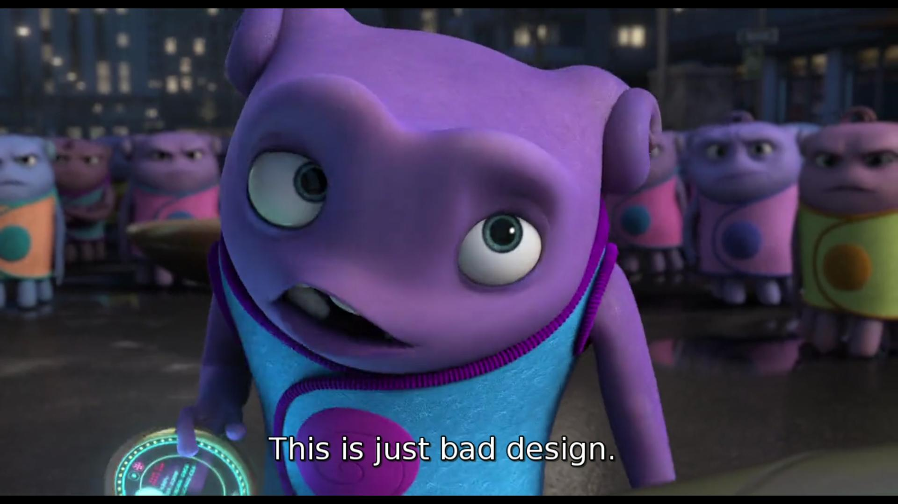
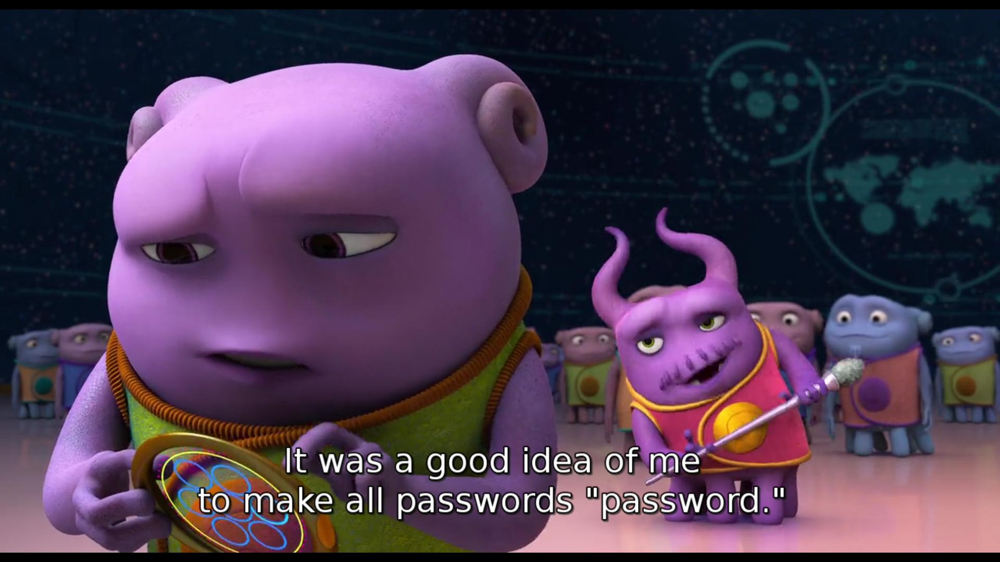
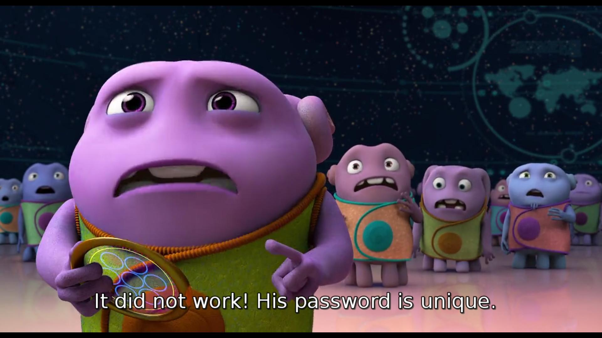
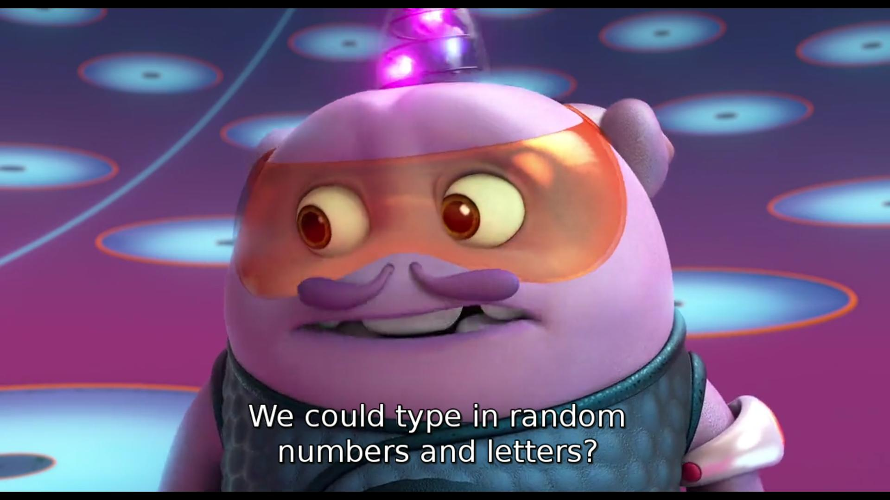
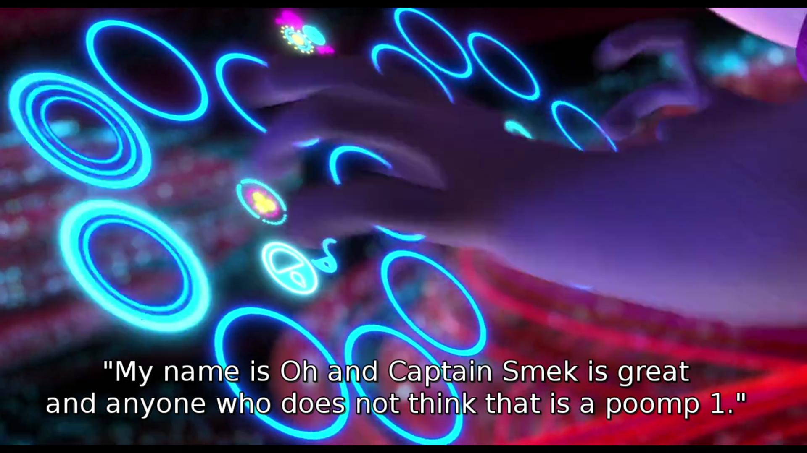

% Passwords at Home -- What a Family Movie Can Teach Us About Passwords
% Peter Parkanyi
% 01 October 2015

We have to talk some more about passwords. Most people have more
online accounts than their password manager can remember, which is bad
enough. Surely, using the same password everywhere would be catastrophic.

Still, most people maintain terrible password policies. [Infosec
people](https://twitter.com/SwiftOnSecurity) are working hard on
improving the situation by educating users who take the
first step, but it's a far cry from being effective [for the average
net user](http://cynosureprime.blogspot.com/2015/09/csp-our-take-on-cracked-am-passwords.html).

So we have to educate the population about passwords and privacy in
more effective ways. Like making a blockbuster family animation movie.

In [Home](http://www.imdb.com/title/tt2224026/?ref_=nv_sr_2),
colour-changing, octopus-like blobs with high-tech gadgets, the
*Boov*, take over Earth. Kids will hear about the friendship of Oh, a
clumsy Boov (Jim Parsons), and Tip, a human girl (Rihanna).

Parents, on the other hand, will be told about passwords, privacy,
and, to some extent, reflections on the
[going-dark](http://www.economist.com/news/leaders/21639506-just-threat-terrorism-increasing-ability-western-security-agencies-defeat)
debate, too (whether intentional or not). With gadgets, come
passwords, and with an alien race, comes a new socio-political
system. However stupid this all sounds in an animated family comedy.

## Not my fault

The movie hits up with Oh screwing up. He wants to send an email to
his friend, but ends up sending it to the whole Universe, and along
with it, the Boov's arch enemy, the Gorg.

Have you ever hit "Reply All" instead of "Reply"? I certainly have.
My screw-ups haven't ended as badly as inviting a Death Star-like
killing machine for a good ole genocide, but let's just say I've got
into the habit of double-checking early on in my career.

Oh is very quick and right about pinpointing whose fault it is.

Everyone and their dogs have written about the problems with the
fundamental usability problems of
[email](https://gigaom.com/2011/08/04/what%E2%80%99s-wrong-with-email-today/),
[PGP](http://www.thoughtcrime.org/blog/gpg-and-me),
[XMPP](http://op-co.de/blog/posts/mobile_xmpp_in_2014/), and you
probably also have your own reasons why Thunderbird, Gmail WhatsApp,
and the rest, suck. We have already realised that UI, where
catastrophic failure and sending a party invite are literally a few
millimeters away, is not *user-friendly*, but many desktop apps are still in
the stone age. How did anyone ever think the menubar is a good idea?

## I will be a hero Boov for getting your password!

Home doesn't fail to pitch in on the topic of handing our private keys
[to our
rulers](https://www.eff.org/deeplinks/2015/07/top-five-takeaways-todays-hearings-encryption),
either.  There's 40 hours (because light speed, I assume) to stop the
message from reaching the Gorg. This involves going to Oh's mail
account, and cancel the message (This will stop the catastrophy,
although I can't Boov science enough to explain how this works).

But Oh's email account is password protected!

So the Boov, apparently under instruction of their Great Leader, set
everyone's email password to "password". Only there's a problem.

If we outlaw passwords, only outlaws will have passwords. Sounds familiar?
Oh set his own password because he never got the memo that he
shouldn't. He never *wanted* to be a criminal. But here we are.

Any suggestions how to recover a unique password?

## Brute Force!

I can't believe my eyes, as the Boov proceed to ramp up a brute-force
operation, with thousands of Boov connecting to a Ghost in the
Shell-like cyberspace, and cracking Oh's password. In a blockbuster
family movie, not a cyberpunk dystopia.

Oh's password is going to be hard to crack using brute force, though.

Oh's passphrase has everything you need: letters, numbers, capitals,
multiple words, and it's as long as any self-respecting paranoid
would use. That's 88 characters!

Oh enters his passphrase, the message is cancelled and doesn't reach the
Gorg. The planet is safe, but the story doesn't end here. To save more
spoilers, I urge you to go watch the movie if all this sounds
intriguing.

## Come party!

Companies and organisations force common knowledge password policies
for systems that protect pieces of infrastructure, business-critical
documents, or even on employee PCs. Governments are increasingly
pushing for the right to access everything and anything out there, and
if someone doesn't comply with policy, they will strike down with
great vengeance and furious anger.

Not only does Home depict in a playful way how technology has became
part of our life, and what bad practices we use every day, it also
reflects on commonplace bad policies. Fixing these issues is a long
and tedious process, and [everywhere](https://savecrypto.org/) we need
to be
[proactive](https://www.openrightsgroup.org/campaigns/dont-let-the-snoopers-charter-bounce-back)
about it. The best place to start is at [home](http://passwordsafe.sourceforge.net/).
